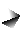
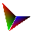
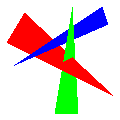
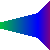
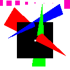
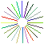

# Rasterizer and Compositor

## Project Overview
Generates the images from the text files. 

The program can rasterizes triangles, lines and points.

- Rasterizing triangles, it use [Digital differential analyzer](https://en.wikipedia.org/wiki/Digital_differential_analyzer_(graphics_algorithm))(DDA) algorithm. It supports the following features:
    - Depth buffer: Rendering objects from far to close.
    - sRGB - RGB conversion: convert colors from sRGB to linear color space before interpolating and convert back to sRGB after interpolating.
    - Frustum clipping: Perform clipping on each primitive befroe rendering.
    
 - Rasterizing lines, it use [Bresenham's line algorithm](https://en.wikipedia.org/wiki/Bresenham%27s_line_algorithm). Drawing an 8-connect line between the two given vertices.

 - Rasterizing points. Filling all pixels in a given square. Support depth buffer.

Note: The text files are in the `reference` folder.

## Requirements
- g++
- [LodePNG](https://lodev.org/lodepng/), which already included in the file

## Usage
    ```sh
    make build
    make run file=$filename # no space between "=", mp1xxx.txt
    ```

## Examples

### Basic Triangles

  

### Depth Image



### Frustum:



### sRGB


### Line and Point

 

